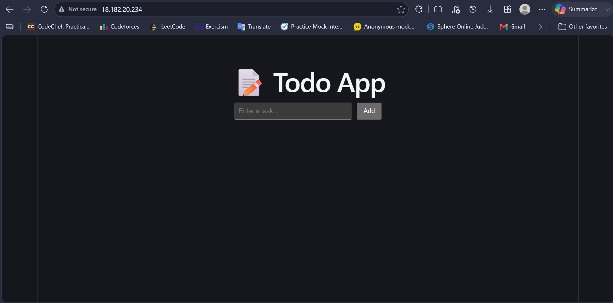

# Todo App — Manual Deployment Guide Using nginx 
> Complete step-by-step guide to deploy the todo app on AWS EC2 Ubuntu using a layer-based approach.

---

## 1. Application Overview
**Todo APP** — a 1-tier full-stack web application.
| Layer    | Technology                     | Runs on        |
|----------|--------------------------------|----------------|
| Frontend | React  + Vite                  | Nginx (static) |

---

## 2. Prerequisites
| Item | Detail |
|------|--------|
| AWS account  | EC2 launch permissions |
| EC2 key pair | `.pem` file on your local machine |
| Ubuntu 22.04 LTS instance | `t2.micro` or larger |
| Security group rules | Ports 22, 80 open inbound |
| Domain (optional) | Required only for SSL — A record pointing to EC2 IP |   

---

## Part A — AWS Console Setup
### A.1 Launch EC2 Instance
1. AMI: **Ubuntu Server 22.04 LTS**
2. Instance type: `t2.micro`
3. Storage: 10 GB gp3

### A.2 Configure Security Group
| Type  | Protocol | Port | Source    |
|-------|----------|------|-----------|
| SSH   | TCP      | 22   | Your IP   |
| HTTP  | TCP      | 80   | 0.0.0.0/0 |

---

## Part B — Server Bootstrap

```bash
sudo apt update && sudo apt upgrade -y
sudo apt install -y git curl wget unzip build-essential
cd ~
git clone https://github.com/Taziim/nginx-react-deploy.git
cd nginx-react-deploy
```
---

## Step 1 — Frontend Layer
### 1.1 Install Nginx
```bash
sudo apt install -y nginx
sudo systemctl start nginx
sudo systemctl enable nginx
```

### 1.2 Build and Deploy React App
```bash
cd ~/nginx-react-deploy/frontend
sudo apt install npm
npm install
npm run build
sudo mkdir -p /var/www/nginx-react-deploy
sudo rm -rf /var/www/nginx-react-deploy/*
sudo cp -r dist/* /var/www/nginx-react-deploy/
sudo chown -R www-data:www-data /var/www/nginx-react-deploy
sudo chmod -R 755 /var/www/nginx-react-deploy
```

### 3.3 Configure Nginx
Get EC2 IP:
```bash
TOKEN=$(curl -s -X PUT "http://169.254.169.254/latest/api/token" -H "X-aws-ec2-metadata-token-ttl-seconds: 21600")
EC2_IP=$(curl -s -H "X-aws-ec2-metadata-token: $TOKEN" http://169.254.169.254/latest/meta-data/public-ipv4)
echo $EC2_IP
```

Write Nginx virtual host config (replace `YOUR_SERVER_NAME` with your EC2 IP or domain):
```bash
sudo tee /etc/nginx/sites-available/nginx-react-deploy > /dev/null << 'EOF'
server {
    listen 80;
    server_name YOUR_SERVER_NAME;

    root /var/www/nginx-react-deploy;
    index index.html;

    # React SPA — serve index.html for all non-file routes
    location / {
        try_files $uri $uri/ /index.html;
    }

    # Proxy API requests to Node.js backend
    location /api/ {
        proxy_pass http://127.0.0.1:3000;
        proxy_http_version 1.1;
        proxy_set_header Upgrade $http_upgrade;
        proxy_set_header Connection 'upgrade';
        proxy_set_header Host $host;
        proxy_set_header X-Real-IP $remote_addr;
        proxy_set_header X-Forwarded-For $proxy_add_x_forwarded_for;
        proxy_set_header X-Forwarded-Proto $scheme;
        proxy_cache_bypass $http_upgrade;
    }

    # Security headers
    add_header X-Frame-Options "SAMEORIGIN";
    add_header X-Content-Type-Options "nosniff";
    add_header X-XSS-Protection "1; mode=block";
}
EOF
```

Enable site and reload:
```bash
sudo ln -sf /etc/nginx/sites-available/nginx-react-deploy /etc/nginx/sites-enabled/nginx-react-deploy
sudo rm -f /etc/nginx/sites-enabled/default
sudo nginx -t && sudo systemctl restart nginx
```
---
   
### Screenshot
Site running on public IP:


*Tariqul Islam*  
📧 Email: tariqulislamtazim99@gmail.com  
🔗 LinkedIn: https://www.linkedin.com/in/tariqulislamtazim/
---